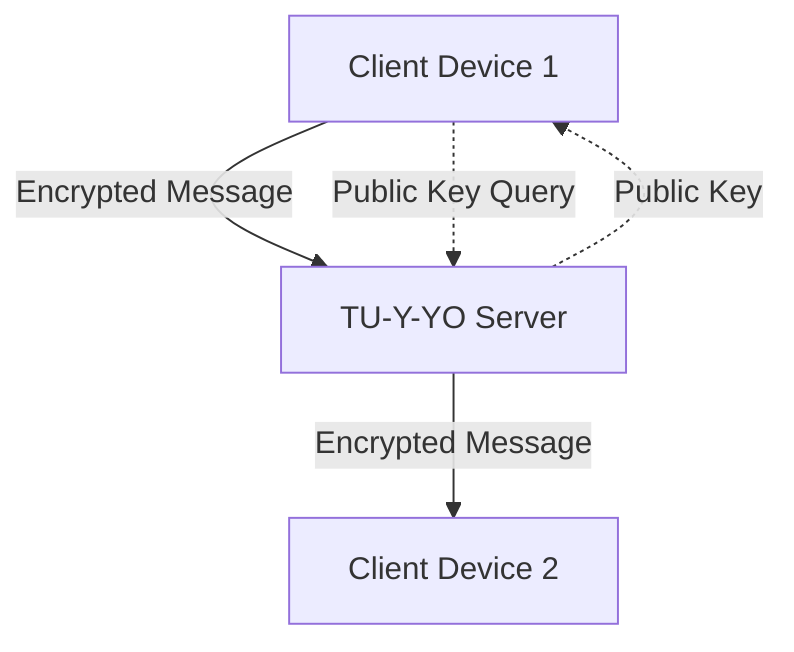

# TU-Y-YO Secure Messaging

A premium messaging application featuring end-to-end encryption (E2EE) with a custom design system.

## Project Architecture



## Encryption Flow

1. Key Generation: Each user generates an RSA-OAEP key pair upon registration.
2. Key Storage: Public keys are sent to the server. Private keys are wrapped using a PBKDF2-derived key from the user's password and stored in the browser's IndexedDB.
3. Message Encryption:
   - The sender fetches the recipient's public key from the server.
   - The sender generates a random AES-GCM symmetric key.
   - The message is encrypted with the AES key.
   - The AES key is encrypted with the recipient's RSA public key.
4. Transmission: The encrypted message and the encrypted AES key are sent to the server.
5. Decryption:
   - The recipient receives the payload.
   - The recipient decrypts the AES key using their RSA private key.
   - The recipient decrypts the message using the AES key.

## Key Management

- Public Keys: Stored in a MongoDB database on the server.
- Private Keys: Never leave the client. They are stored as non-extractable CryptoKey objects in IndexedDB.
- Key Wrapping: Private keys are encrypted at rest on the client using a key derived from the user's password via PBKDF2 with 600,000 iterations.

## Security Trade-offs

- Performance vs Security: Using 600,000 PBKDF2 iterations adds delay during login but significantly increases resistance to brute-force attacks.
- Browser Storage: IndexedDB is used for persistence. While more secure than LocalStorage, it depends on the host OS and browser security boundaries.

## Known Limitations

- Multi-device Sync: Currently, private keys are tied to a single device. Logging in on a new device requires generating a new key pair or a manual key transfer mechanism which is not yet implemented.
- Metadata: Message metadata (sender, recipient, timestamp) is visible to the server for routing purposes.

## Tech Stack

- Frontend: React 19, Vite 8, Framer Motion, Lucide React
- Backend: Node.js, Express, MongoDB, WebSocket (ws)
- Cryptography: Web Crypto API

## Getting Started

### Prerequisites
- Node.js
- MongoDB

### Installation

1. Server:
   ```bash
   cd server
   npm install
   node server.js
   ```

2. Client:
   ```bash
   cd client
   npm install
   npm run dev
   ```
